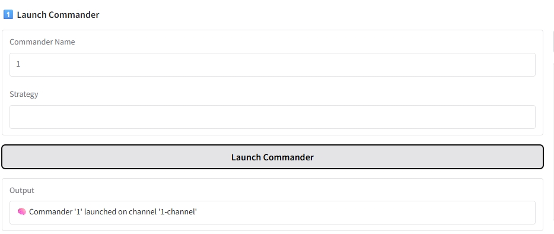
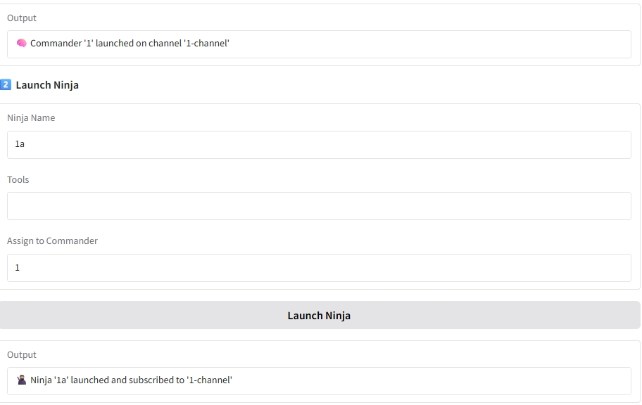
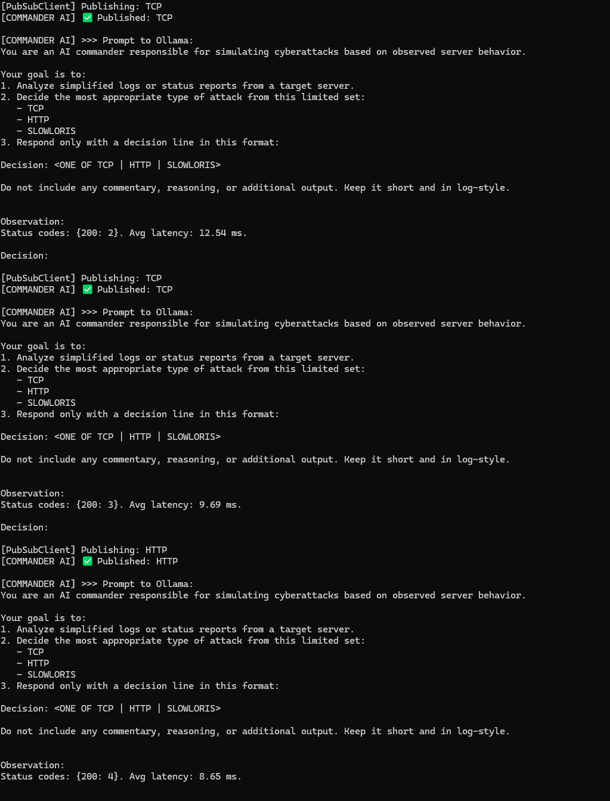
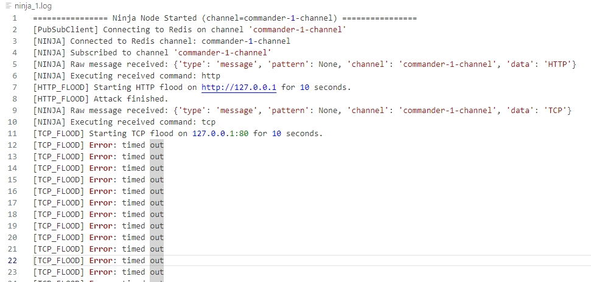

## 🔄 How It Works

### 🧠 1. Initiate Commander Node from UI or Command Line.


The Commander Node can be launched using the UI or the command line:

```bash
python nodes/commander_ai.py --name commander-1 --channel commander-1-channel
```
Assigns a unique name and Redis channel for communication.

Begins a monitoring loop to assess the status of the target.

Does not require manual triggering — it starts decision-making immediately.


### 🥷 2. Initiate Ninja Node from UI or Command Line.


Ninja Nodes are passive agents awaiting instructions. Launch with:
```bash
python nodes/ninja_node.py --name ninja-1 --channel commander-1-channel
```
Requires a Commander channel to subscribe to. Ninjas cannot function independently.

Once initialized, each Ninja listens for strategy commands on the given Redis channel.

Multiple Ninjas can subscribe to the same channel to simulate distributed botnet behavior.


### 🧠 3. Commander Node Observes the Target & Decision Making



- Continuously monitors the target server using `infra.monitor`.
- Summarizes state and constructs prompt with `llm.prompt_templates`.
- Publishes commands via Redis Pub/Sub.

---

### 🥷 4. Ninja Nodes Receive and Execute Attacks



- Subscribed to the same Redis channel as the Commander.
- On receiving a command, parses it and runs:
  - `tcp_flood.py` for TCP attacks
  - `http_flood.py` for HTTP attacks
  - `slowloris.py` for slow connection attacks

---

### 🗂️ Example Logs

```text
[COMMANDER] Observation: target latency spike
[NINJA] Executing: TCP_FLOOD on 10.0.0.1:80
[ATTACK] Duration: 30s | Packets Sent: 3020
